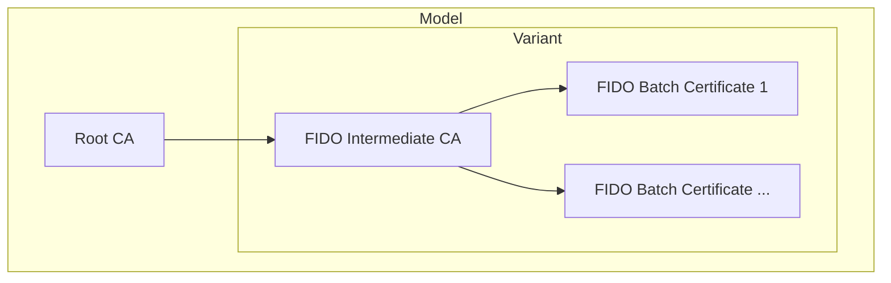

# Nitrokey Certificates

This directory contains the following certificates for the Nitrokey 3 and Nitrokey Passkey:
- **Root CA** (one per model): used to sign the intermediate CAs
- **FIDO Intermediate CA** (one per variant): used to sign the FIDO batch certificates
- **FIDO Batch Certificate** (one or more per variant): used as the [WebAuthn Attestation Certificate][webauthn-attestation] for a batch of devices

[webauthn-attestation]: https://www.w3.org/TR/webauthn-2/#attestation-certificate

| Model | Variant | Root CA | FIDO Intermediate CA | FIDO Batch Certificates |
| --- | --- | --- | --- | --- |
| Nitrokey 3 | NK3AM | [nk3/root-ca.pem](./nk3/root-ca.pem) | [nk3/nk3am/fido-ca.pem](./nk3/nk3am/fido-ca.pem) | [nk3/nk3am/fido-batch-1.pem](./nk3/nk3am/fido-batch-1.pem) |
| Nitrokey 3 | NK3xN | [nk3/root-ca.pem](./nk3/root-ca.pem) | [nk3/nk3xn/fido-ca.pem](./nk3/nk3xn/fido-ca.pem) | [nk3/nk3xn/fido-batch-1.pem](./nk3/nk3xn/fido-batch-1.pem) |
| Nitrokey Passkey | | [nkpk/root-ca.pem](./nkpk/root-ca.pem) | [nkpk/fido-ca.pem](./nkpk/fido-ca.pem) | [nkpk/fido-batch-1.pem](./nkpk/fido-batch-1.pem) |
